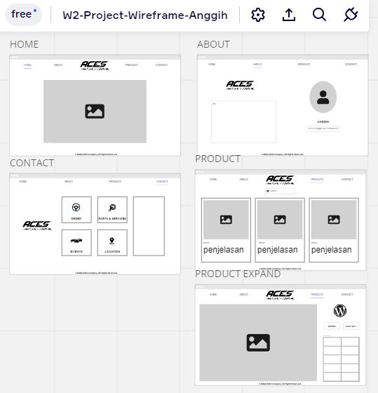
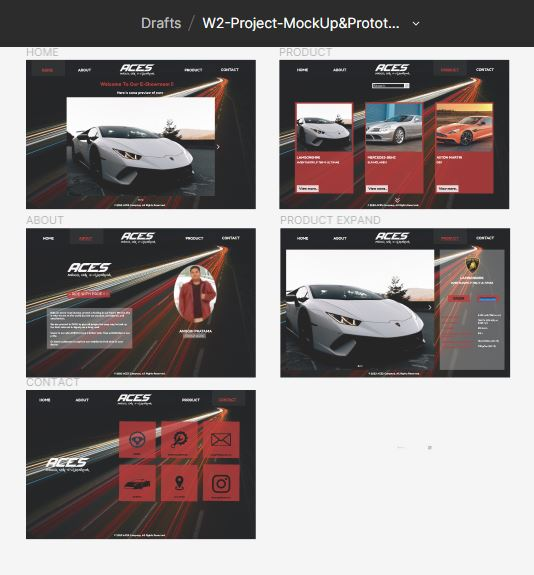
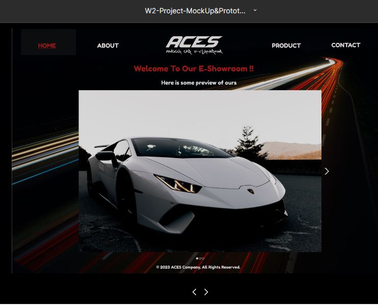

# Anggih - UI UX Design

> This UI UX Design was made with purpose to fulfill the Week-2 Assignment of RevoU FSSE Madrid 2023

Mockup on Figma: [W2-Project-MockUp&Prototyping-Anggih](https://www.figma.com/file/0iNUGujoGtRpP9aDt1xYca/W2-Project-MockUp%26Prototyping-Anggih)

Prototyping on Figma: [W2-Project-MockUp&Prototyping-Anggih](https://www.figma.com/proto/0iNUGujoGtRpP9aDt1xYca/W2-Project-MockUp%26Prototyping-Anggih)

Wireframe on Miro: [W2-Project-Wireframe-Anggih](https://miro.com/app/board/uXjVPuW8ogI=/#tpicker-content)

## Inspiration

- Website: <https://www.astra-honda.com/>
- Website: <https://www.franshalsmuseum.nl/en/>
- PC Game : [Need for Speed™ Most Wanted](https://www.ea.com/games/need-for-speed/need-for-speed-most-wanted)

## Color

- White #FFFFFF
- Carnelian #B01D1D

## Pages

- HOME
- ABOUT
- PRODUCT
- CONTACT

## Screenshots

### Miro (Wireframe)

### Figma (Mockup)

### Figma (Prototyping)

